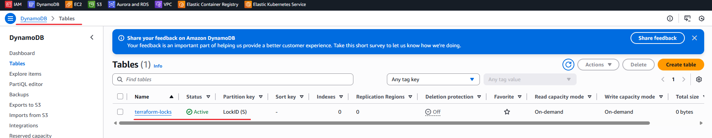
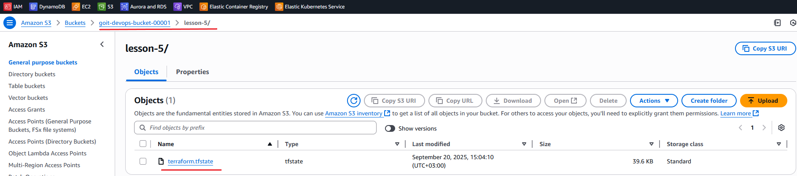
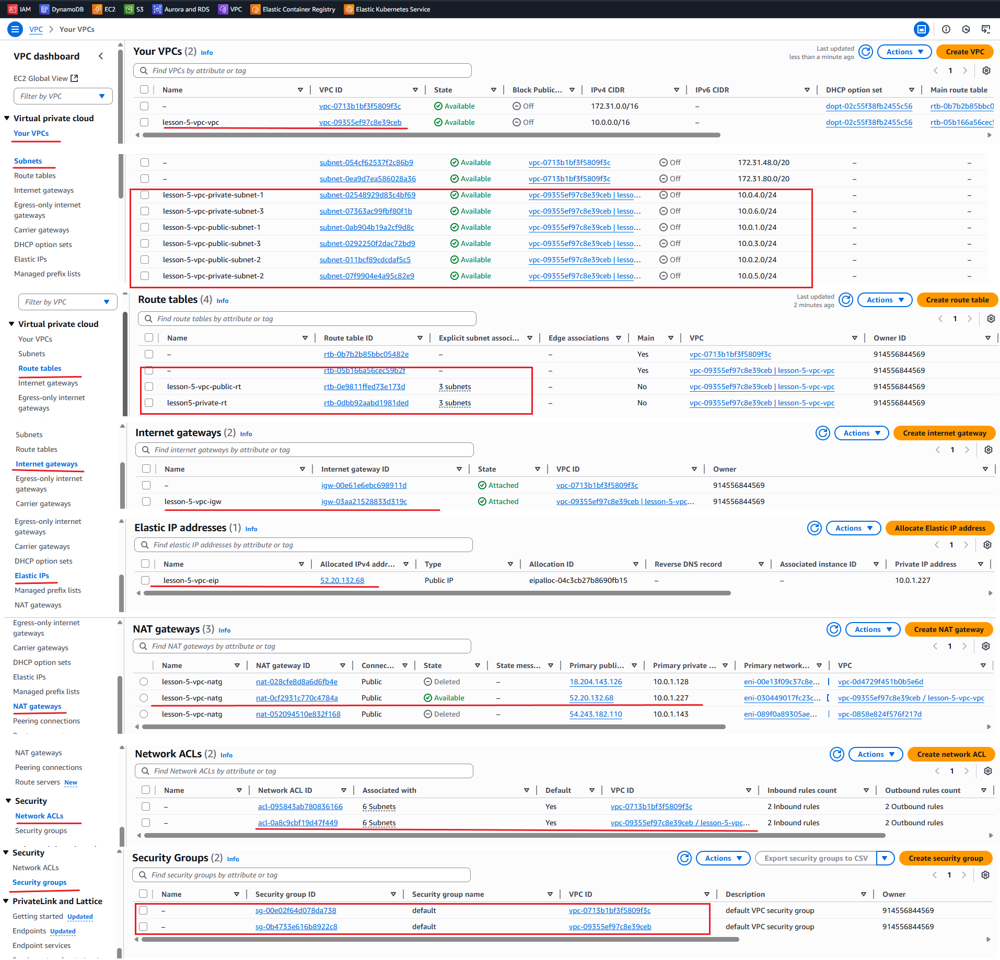
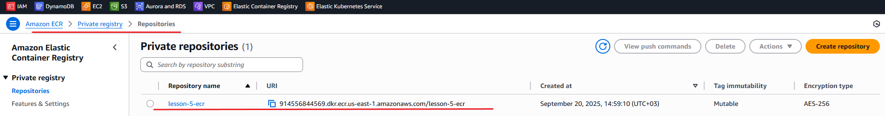

# Домашнє завдання до теми «IaC (Terraform)»

## Структура проєкту

    lesson-5/
    │
    ├── main.tf                  # Головний файл для підключення модулів
    ├── backend.tf               # Налаштування бекенду для стейтів (S3 + DynamoDB)
    ├── outputs.tf               # Загальне виведення ресурсів
    │
    ├── modules/                 # Каталог з усіма модулями
    │   │
    │   ├── s3-backend/          # Модуль для S3 та DynamoDB
    │   │   ├── s3.tf            # Створення S3-бакета
    │   │   ├── dynamodb.tf      # Створення DynamoDB
    │   │   ├── variables.tf     # Змінні для S3
    │   │   └── outputs.tf       # Виведення інформації про S3 та DynamoDB
    │   │
    │   ├── vpc/                 # Модуль для VPC
    │   │   ├── vpc.tf           # Створення VPC, підмереж, Internet Gateway
    │   │   ├── routes.tf        # Налаштування маршрутизації
    │   │   ├── variables.tf     # Змінні для VPC
    │   │   └── outputs.tf       # Виведення інформації про VPC
    │   │
    │   └── ecr/                 # Модуль для ECR
    │       ├── ecr.tf           # Створення ECR репозиторію
    │       ├── variables.tf     # Змінні для ECR
    │       └── outputs.tf       # Виведення URL репозиторію ECR
    │
    └── README.md                # Документація проєкту

1. Модуль s3-backend керує налаштуваннями для зберігання та блокування terraform states. Він створює S3-bucket для зберігання Terraform state та DynamoDB table для блокування стейтів.

2. Модуль vpc/ використовується для налаштування віртуального мережевого простору. Створює Virtual Private Cloud (VPC) з трьома публічними підмережами для доступу в Інтернет через шлюз та трьома приватними підмережами з доступом до Інтернету через NAT Gateway. Керує маршрутизацією за відповідними таблицями.

3. Модуль ecr/ створює ECR репозиторій з автоматичним скануванням образів.

## Порядок ініціалізації та запуску

> <b>Увага!</b> Перед запуском проєкту у вас має бути налаштовані AWS credentials у вашій CLI! Використовуйте <b><i>aws configure</i></b> для налаштувань.  
> Також вміст файлу <b><i>backend.tf</i></b> при першій ініціалізації має бути закоментований.

Ініціалізація проєкту перед виконанням здійснюється командою <b><i>terraform init</i></b>.

Для перевірки змін та того, що буде виконано, використовуємо команду <b><i>terraform plan</i></b>.

> <b>Увага!</b> Для створення файлу конфігурації стейту та копіювання його на s3-bucket розкоментуйте файл <b><i>backend.tf</i></b> та виконайте команду <b><i>terraform init -reconfigure</i></b>.

Для застосування змін використовуємо команду <b><i>terraform apply</i></b>.

Для видалення створених ресурсів використовуємо команду <b><i>terraform destroy</i></b>.

> <b>Увага!</b> Ресурс <b><i>s3-bucket</i></b> буде видалено лише якщо сховище порожнє.

## Результати виконання

<h3>Створена таблиця DynamoDB</h3>

<h3>Створений s3-bucket</h3>

<h3>Створена VPC</h3>

<h3>Створений репозиторій ECR</h3>

