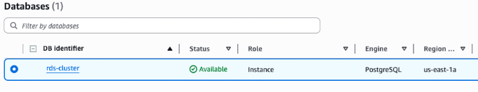

# Домашнє завдання до теми «IaC (Terraform)»

## Структура проєкту

    lesson-5/
    │
    ├── main.tf                  # Головний файл для підключення модулів
    ├── backend.tf               # Налаштування бекенду для стейтів (S3 + DynamoDB)
    ├── jenkins.tf
    ├── outputs.tf               # Загальне виведення ресурсів
    ├── variables.tf
    ├── django.yaml
    │
    ├── modules/                 # Каталог з усіма модулями
    │   │
    │   ├── s3-backend/          # Модуль для S3 та DynamoDB
    │   │   ├── s3.tf            # Створення S3-бакета
    │   │   ├── dynamodb.tf      # Створення DynamoDB
    │   │   ├── variables.tf     # Змінні для S3
    │   │   └── outputs.tf       # Виведення інформації про S3 та DynamoDB
    │   │
    │   ├── vpc/                 # Модуль для VPC
    │   │   ├── vpc.tf           # Створення VPC, підмереж, Internet Gateway
    │   │   ├── routes.tf        # Налаштування маршрутизації
    │   │   ├── variables.tf     # Змінні для VPC
    │   │   └── outputs.tf       # Виведення інформації про VPC
    │   │
    │   ├── ecr/                 # Модуль для ECR
    │   │   ├── ecr.tf           # Створення ECR репозиторію
    │   │   ├── variables.tf     # Змінні для ECR
    │   │   └── outputs.tf       # Виведення URL репозиторію ECR
    │   │
    │   ├── eks/                 # Модуль для Kubernetes кластера
    │   │   ├── eks.tf           # Створення кластера
    │   │   ├── variables.tf     # Змінні для EKS
    │   │   └── outputs.tf       # Виведення інформації про кластер
    │   │
    │   ├── rds/                 # Модуль для RDS
    │   │   ├── rds.tf           # Створення RDS бази даних
    │   │   ├── aurora.tf        # Створення aurora кластера бази даних
    │   │   ├── shared.tf        # Спільні ресурси
    │   │   ├── variables.tf     # Змінні (ресурси, креденшели, values)
    │   │   └── outputs.tf
    │   │
    │   ├── jenkins/             # Модуль для Helm-установки Jenkins
    │   │   ├── jenkins.tf       # Helm release для Jenkins
    │   │   ├── variables.tf     # Змінні (ресурси, креденшели, values)
    │   │   ├── providers.tf     # Оголошення провайдерів
    │   │   ├── values.yaml      # Конфігурація jenkins
    │   │   └── outputs.tf       # Виводи (URL, пароль адміністратора)
    │   │
    │   └── argo_cd/             # ✅ Новий модуль для Helm-установки Argo CD
    │       ├── jenkins.tf       # Helm release для Jenkins
    │       ├── variables.tf     # Змінні (версія чарта, namespace, repo URL тощо)
    │       ├── providers.tf     # Kubernetes+Helm.  переносимо з модуля jenkins
    │       ├── values.yaml      # Кастомна конфігурація Argo CD
    │       └── outputs.tf       # Виводи (hostname, initial admin password)
    │		    └──charts/                  # Helm-чарт для створення app'ів
    │ 	 	    ├── Chart.yaml
    │	  	    └── values.yaml          # Список applications, repositories
    │			    └── templates/
    │		        ├── application.yaml
    │		        └── repository.yaml
    │
    ├── charts/
    │   └── django-app/
    │       ├── templates/
    │       │   ├── deployment.yaml
    │       │   ├── service.yaml
    │       │   ├── configmap.yaml
    │       │   └── hpa.yaml
    │       ├── Chart.yaml
    │       └── values.yaml
    │
    ├── Django/
    │   └── goit/
    │       ├── templates/
    │       │   ├── __init__.py
    │       │   ├── asgi.py
    │       │   ├── settings.py
    │       │   ├── urls.py
    │       │   └── wsgi.py
    │       ├── Dockerfile
    │       ├── manage.py
    │       └── requirements.txt
    │
    └── README.md                # Документація проєкту

1. Модуль s3-backend керує налаштуваннями для зберігання та блокування terraform states. Він створює S3-bucket для зберігання Terraform state та DynamoDB table для блокування стейтів.

2. Модуль vpc/ використовується для налаштування віртуального мережевого простору. Створює Virtual Private Cloud (VPC) з трьома публічними підмережами для доступу в Інтернет через шлюз та трьома приватними підмережами з доступом до Інтернету через NAT Gateway. Керує маршрутизацією за відповідними таблицями.

3. Модуль ecr/ створює ECR репозиторій з автоматичним скануванням образів.

4. Модуль eks/ створює EKubernetes кластер.

5. Charts/django-app/ власний Helm-чарт для Django-проєкту

6. Модулі jenkins/ та argo_cd/ відповідають за CI/CD

7. Модуль rds/ відповідає за налаштуваня бази даних

## Порядок ініціалізації та запуску

> <span><span style="color: red"><b>Увага!</b></span> Перед запуском проєкту у вас має бути налаштовані AWS credentials у вашій CLI! Використовуйте <b><i>aws configure</i></b> для налаштувань.</span>  
> <span>Також вміст файлу <b><i>backend.tf</i></b> при першій ініціалізації має бути закоментований.</span>

<p>Ініціалізація проєкту перед виконанням здійснюється командою <b><i>terraform init</i></b>.</p>
<p>Для перевірки змін та того, що буде виконано, використовуємо команду <b><i>terraform plan</i></b>.</p>

<p>Для застосування змін використовуємо команду <b><i>terraform apply</i></b>.</p>

> <span><span style="color: red"><b>Увага!</b></span> Для створення файлу конфігурації стейту та копіювання його на s3-bucket після виконання попередньої команди розкоментуйте файл <b><i>backend.tf</i></b> та виконайте команду <b><i>terraform init -reconfigure</i></b>.</span>

<p>Для видалення створених ресурсів використовуємо команду <b><i>terraform destroy</i></b>.</p>

> <span><span style="color: red"><b>Увага!</b></span> Ресурс <b><i>s3-bucket</i></b> буде видалено лише якщо сховище порожнє.</span>

## Переносимо образ, створений в lesson-4, на ECR репозиторій

```bash
docker tag lesson-4-django:latest <ecr_repo>
docker push <ecr_repo>
```

## Встановлюємо Django app за допомогою Helm Chart

```bash
cd charts/django-app
helm upgrade --install django-app . --namespace django --create-namespace
```

## Перенапоравляємо порт

```bash
kubectl port-forward svc/django-app 8000:8000 -n django
```

## Виконання Jenkins

```bash
kubectl -n argocd get secret argocd-initial-admin-secret -o jsonpath="{.data.password}" | base64 -d
```

## Модуль RDS

```bash
module "rds" {
  source = "./modules/rds"

  name                = "my-db"
  db_name             = "appdb"
  username            = "admin"
  password            = "supersecret"
  vpc_id              = "vpc-123456"
  vpc_cidr_block      = "10.0.0.0/16"
  subnet_private_ids  = ["subnet-aaa", "subnet-bbb"]
  subnet_public_ids   = ["subnet-ccc", "subnet-ddd"]
  publicly_accessible = false
  multi_az            = false
  use_aurora          = true       # true -> Aurora Cluster, false -> Standard RDS
  aurora_replica_count = 1         # Кількість reader реплік для Aurora
  instance_class      = "db.t3.medium"
  allocated_storage   = 20         # Для стандартного RDS
  engine_version      = "14.7"     # Для RDS
  engine_version_cluster = "15.3"  # Для Aurora
  parameters          = {
    max_connections = "100"
    log_statement  = "none"
    work_mem       = "4MB"
  }
  tags = {
    Project = "Demo"
    Env     = "Dev"
  }
}
```

## Опис змінних

| Змінна                          | Тип          | Опис                                                      | Default             |
| ------------------------------- | ------------ | --------------------------------------------------------- | ------------------- |
| `name`                          | string       | Назва інстансу або кластера                               | –                   |
| `use_aurora`                    | bool         | Використовувати Aurora (true) чи стандартний RDS (false)  | false               |
| `db_name`                       | string       | Назва бази даних                                          | –                   |
| `username`                      | string       | Користувач бази даних                                     | –                   |
| `password`                      | string       | Пароль користувача (sensitive)                            | –                   |
| `engine`                        | string       | Двигун для стандартного RDS                               | postgres            |
| `engine_version`                | string       | Версія для стандартного RDS                               | 14.7                |
| `engine_cluster`                | string       | Двигун для Aurora                                         | aurora-postgresql   |
| `engine_version_cluster`        | string       | Версія для Aurora                                         | 15.3                |
| `instance_class`                | string       | Клас інстансу (тип EC2)                                   | db.t3.medium        |
| `allocated_storage`             | number       | Для стандартного RDS (GB)                                 | 20                  |
| `aurora_replica_count`          | number       | Кількість reader реплік для Aurora                        | 1                   |
| `publicly_accessible`           | bool         | Доступність бази з Інтернету                              | false               |
| `multi_az`                      | bool         | Multi-AZ для стандартного RDS                             | false               |
| `parameters`                    | map(string)  | Додаткові параметри бази (max_connections, work_mem тощо) | {}                  |
| `backup_retention_period`       | string       | Кількість днів для збереження бекапів                     | ""                  |
| `tags`                          | map(string)  | Теги для всіх ресурсів                                    | {}                  |
| `vpc_id`                        | string       | ID VPC                                                    | –                   |
| `vpc_cidr_block`                | string       | CIDR блок VPC                                             | –                   |
| `subnet_private_ids`            | list(string) | Список приватних subnet                                   | –                   |
| `subnet_public_ids`             | list(string) | Список публічних subnet                                   | –                   |
| `parameter_group_family_aurora` | string       | Family для Aurora PG                                      | aurora-postgresql15 |
| `parameter_group_family_rds`    | string       | Family для стандартного RDS PG                            | postgres15          |

## Як змінити тип БД, engine та клас інстансу

Тип БД:  
use_aurora = true → створюється Aurora Cluster.  
use_aurora = false → створюється стандартний RDS інстанс.

Engine:  
Для стандартного RDS: engine та engine_version.  
Для Aurora: engine_cluster та engine_version_cluster.

Клас інстансу:  
Встановлюється через instance_class (db.t3.micro).

Репліки Aurora:  
Кількість reader реплік задається через aurora_replica_count.

## Вихідні дані

| Output         | Опис                             |
| -------------- | -------------------------------- |
| `rds_endpoint` | Endpoint для підключення до бази |

output "rds_endpoint" {
description = "RDS endpoint for connecting to the database"
value = var.use_aurora ? aws_rds_cluster.aurora[0].endpoint : aws_db_instance.standard[0].endpoint
}

## Результат

<p>Піднята PostgreSQL (флаг "use_aurora" встановлено як "false")</p>

